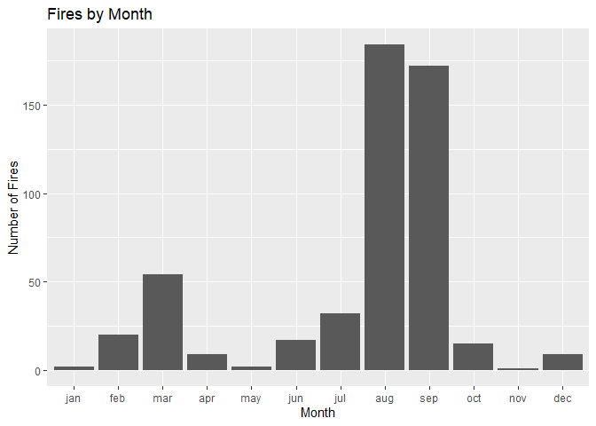
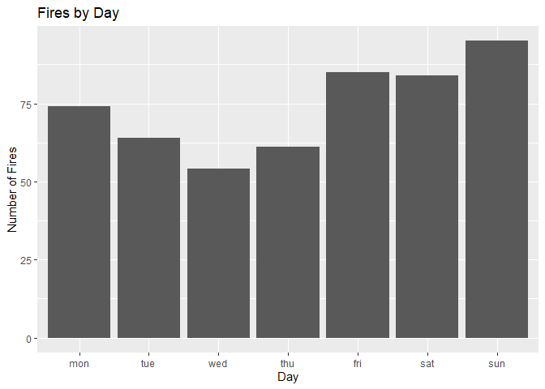
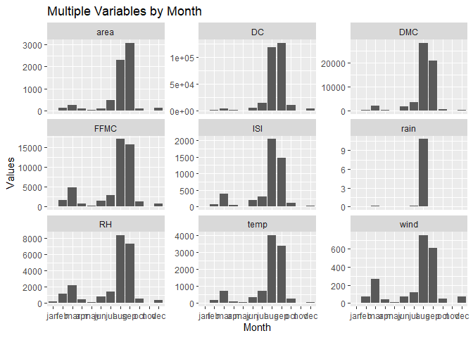
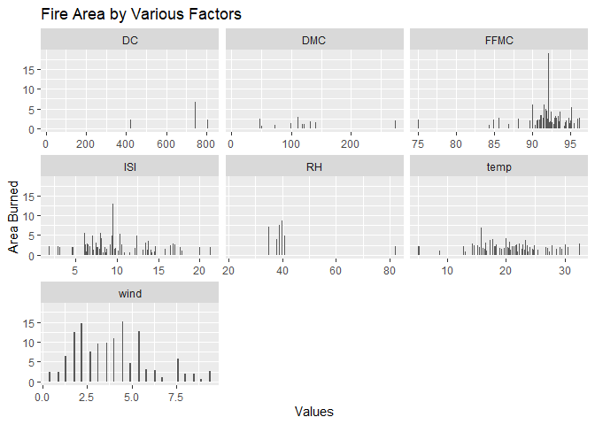

Forest Fires Analysis
================
Aimee
2024-10-19

## Introduction

This analysis explores the forest fires dataset, focusing on grouping
values by month and day, and creating visualizations to better
understand the data.

## Loading Libraries and Data

We begin by loading the necessary libraries and reading the forest fires
dataset.

``` r
# Loading the necessary libraries
library(tidyverse)
```

    ## ── Attaching core tidyverse packages ──────────────────────── tidyverse 2.0.0 ──
    ## ✔ dplyr     1.1.4     ✔ readr     2.1.5
    ## ✔ forcats   1.0.0     ✔ stringr   1.5.1
    ## ✔ ggplot2   3.5.1     ✔ tibble    3.2.1
    ## ✔ lubridate 1.9.3     ✔ tidyr     1.3.1
    ## ✔ purrr     1.0.2     
    ## ── Conflicts ────────────────────────────────────────── tidyverse_conflicts() ──
    ## ✖ dplyr::filter() masks stats::filter()
    ## ✖ dplyr::lag()    masks stats::lag()
    ## ℹ Use the conflicted package (<http://conflicted.r-lib.org/>) to force all conflicts to become errors

``` r
# Loading the dataset
forestfires <- read.csv("forestfires.csv")
```

## Data Preparation

To ensure proper ordering of the `day` and `month` columns, we use the
`mutate` function to convert them into factors with specific levels.

``` r
# Applying 'factors' to order the columns 'day' and 'month'
forestfires <- forestfires %>%
  mutate(month = factor(month, 
                        levels = c("jan", "feb", "mar", "apr", "may", "jun", 
                                   "jul", "aug", "sep", "oct", "nov", "dec"))) %>%
  mutate(day = factor(day, levels = c("mon", "tue", "wed", "thu", "fri", "sat", "sun")))
```

## Grouping and Counting Fires by Day and Month

Next, we group the dataset by `month` and `day` to count the number of
fire incidents for each.

``` r
# Grouping the values by day and month
fires_by_month <- forestfires %>%
  group_by(month) %>%
  count()

fires_by_day <- forestfires %>%
  group_by(day) %>%
  count()
```

## Visualizing Fires by Month and Day

We create bar plots to visualize the number of fires by month and day.

``` r
# Plotting fires by month
fires_by_month %>%
  ggplot(aes(x = month, y = n)) +
  geom_col() +
  labs(title = "Fires by Month", x = "Month", y = "Number of Fires")
```

<!-- -->

``` r
# Plotting fires by day
fires_by_day %>%
  ggplot(aes(x = day, y = n)) +
  geom_col() +
  labs(title = "Fires by Day", x = "Day", y = "Number of Fires")
```

<!-- -->

## Visualizing Multiple Variables (Facet Plot)

To further analyze the dataset, we pivot the columns containing
fire-related metrics and visualize them using `facet_wrap`.

``` r
# Pivoting the columns for multiple variables
forestfires_long <- forestfires %>%
  pivot_longer(
    cols = c(FFMC, DMC, DC, ISI, temp, RH, wind, rain, area),
    names_to = "column",
    values_to = "values"
  )

# Generating multiple plots with facet_wrap
forestfires_long %>%
  ggplot(aes(x = month, y = values)) +
  geom_col() +
  facet_wrap(vars(column), scales = "free_y") +
  labs(title = "Multiple Variables by Month", x = "Month", y = "Values")
```

<!-- -->

## Analyzing Fire Severity Based on Area

We further explore the relationship between fire severity (measured by
area burned) and various variables. Here, we filter the dataset to focus
on smaller fire incidents (area between 0.5 and 3) and exclude the
`rain` column for better visualization.

``` r
# Pivoting the columns for the area analysis
forestfires_area <- forestfires %>%
  pivot_longer(
    cols = c(FFMC, DMC, DC, ISI, temp, RH, wind, rain),
    names_to = "columns",
    values_to = "values"
  )

# Filtering and visualizing area-related data
forestfires_area %>%
  filter(area >= 0.5 & area <= 3 & columns != "rain") %>%
  ggplot(aes(x = values, y = area)) +
  geom_col() +
  facet_wrap(vars(columns), scales = "free_x") +
  labs(title = "Fire Area by Various Factors", x = "Values", y = "Area Burned")
```

<!-- -->

## Conclusion

In this analysis, we explored the number of fires by month and day,
visualized multiple variables, and analyzed fire severity. This helps in
better understanding the conditions under which forest fires occur and
their potential severity. rmarkdown::render(“README.Rmd”, output_format
= “github_document”)
